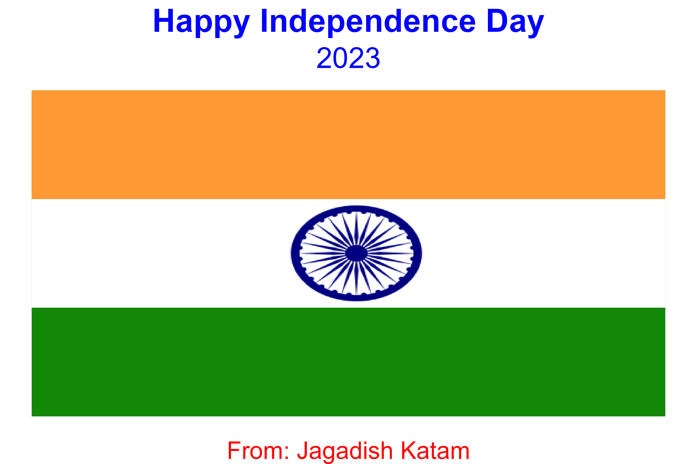

# Indian Flag Visualization using `ggplot2`

## Overview

This R script generates a visualization of the Indian national flag using the ggplot2 library. The script highlights the following features:

Tricolor Representation: The saffron, white, and green colors are arranged in horizontal bands.
Ashoka Chakra: A PNG image of the Ashoka Chakra is placed at the center of the flag.
Custom Title and Caption: The plot includes a title, subtitle, and caption styled for Independence Day.

The final image is saved as a high-resolution PNG file.

